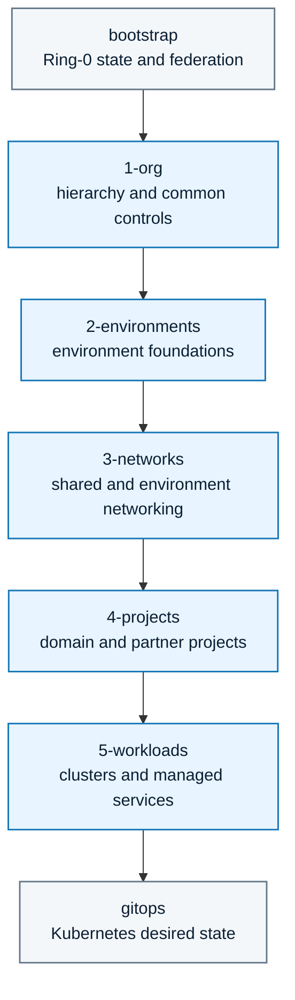

<!-- mindclade-doc: repository-home@1 -->

# Mindclade · Infrastructure Live

> **Platform Foundation · Google Cloud desired state**
> Layered Terraform and Terragrunt for the normal Mindclade cloud estate after Ring 0.

| Repository contract | Value |
| --- | --- |
| Enterprise | [`mindclade`](https://github.com/enterprises/mindclade) |
| Organization | [`mindclade`](https://github.com/mindclade) |
| Repository index | [Mindclade repositories](https://github.com/orgs/mindclade/repositories) |
| Repository | [`mindclade/infrastructure-live`](https://github.com/mindclade/infrastructure-live) |
| Class | `production-control` |
| Visibility | `private` |
| Owner | Infrastructure |
| Production authority | Yes |
| Change model | Pull request; affected plans; exact post-merge saved plans; protected apply |
| Documentation | [`docs/README.md`](docs/README.md) |

This repository is authoritative for normal Google Cloud infrastructure. Ring-0 state,
initial federation, and break-glass recovery remain in `bootstrap`; Kubernetes and Argo CD
desired state remain in `gitops`.

## Authority boundary

This repository owns organization controls, environment foundations, networks, workload
projects, GKE, managed services, cloud-side identities, Binary Authorization, storage,
databases, backups, VPC Service Controls, DNS, and Secret Manager resources. It does not
install Argo CD or applications and does not store secret values.

The diagram shows the enforced layer direction and the two external handoffs.



Dependencies may point within a layer or from a higher-numbered layer to the same or a
lower-numbered layer. Every executable Terragrunt unit has an independent state prefix.

## Repository map

| Path | Responsibility |
| --- | --- |
| `1-org/` | Organization hierarchy, policies, logging, security, and common projects |
| `2-environments/` | Development, staging, and production foundations |
| `3-networks/` | Shared VPC, DNS, NAT, firewall, PSC, and connectivity |
| `4-projects/` | Domain and partner workload projects |
| `5-workloads/` | GKE and managed cloud services |
| `_envcommon/` | Reviewed shared Terragrunt configuration |
| `scripts/` | Tree, dependency, plan, scope, account, and module-interface gates |
| `docs/` | Architecture, contracts, activation gates, handoffs, and runbooks |

## Toolchain and validation

```sh
nix develop
make validate
make plan-development
```

The flake and CI pin Terraform and Terragrunt. CI enables Terragrunt strict mode. Create a
local ignored account contract only from verified bootstrap outputs:

```sh
./scripts/bootstrap-account.sh ../bootstrap
```

Do not hand-edit state bucket, WIF, project-number, or bootstrap project values.

## Exact apply model

Pull requests run formatting, validation, policy and security checks, affected plans, cost
analysis, and destructive-change classification. After merge, `apply.yml` selects the
minimum affected privilege scope, creates saved plans for the exact commit with the plan
identity, stores them for one day with a checksum manifest, waits on the corresponding
protected environment, then verifies and applies the same plans with a scope-specific apply
identity.

Destructive plans require an explicit manual dispatch with `allow_destroy=true` and a
`CHG-`, `INC-`, `SEC-`, or `DR-` change reference. Those inputs do not bypass environment
approval, checksums, account-context validation, or commit matching.

## Start here

- [Documentation index](docs/README.md)
- [Architecture](docs/architecture.md)
- [Dependency graph and apply order](docs/dependency-graph.md)
- [State boundaries](docs/state-boundaries.md)
- [Production activation gates](docs/production-activation-gates.md)
- [Runbooks](docs/runbooks/README.md)
- [Enterprise platform blueprint](BLUEPRINT.md)
