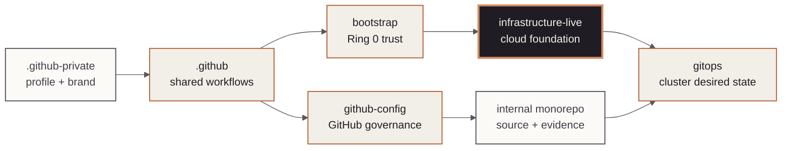

<!-- mindclade-doc: repository-home@2 -->
<!-- Brand distribution: mindclade/.github-private/mindclade-brand-assets (MONO family). -->

<p align="center">
  <picture>
    <source media="(prefers-color-scheme: dark)" srcset="docs/assets/brand/mono-wordmark-dark-1080w.png">
    <source media="(prefers-color-scheme: light)" srcset="docs/assets/brand/mono-wordmark-1080w.png">
    
  </picture>
</p>

<p align="center">
  
  
  
  
</p>

# Mindclade · Infrastructure Live

> **Platform Foundation · Google Cloud desired state**
> Operate the normal cloud estate through isolated Terraform state and an explicit Terragrunt
> dependency graph after Ring 0 is established.

| Repository contract | Value |
| --- | --- |
| Class | `production-control` |
| Visibility | `private` |
| Change model | `pull-request` |
| Authority | `normal-gcp-organization-infrastructure`<br>`folders`<br>`org-policy`<br>`environments`<br>`networks`<br>`projects`<br>`gke`<br>`managed-cloud-services` |
| Primary readers | Cloud platform, security, and reliability engineers |
| First success | [Validate the live estate source](#quick-start) |
| Start here | [`docs/README.md`](docs/README.md) |

## Mission

`infrastructure-live` is the authoritative normal-plane Google Cloud configuration. Platform
engineers use its numbered Terragrunt layers to create organization controls, environments,
networks, projects, GKE, and managed services with independent state boundaries.

## Authority boundary

### This repository creates

- Organization hierarchy and policy after the bootstrap boundary.
- Development, staging, and production foundations, networks, and workload projects.
- GKE and managed cloud services, cloud-side workload identities, and GitOps prerequisites.

### This repository deliberately does not create

- Ring-0 state, initial federation, or break-glass recovery; those remain in `bootstrap`.
- Argo CD installation, Kubernetes objects, or application selection; those remain in `gitops`.
- Application source or reusable Terraform modules; those remain in the monorepo.

## Quick start

Prerequisite: Nix with flakes enabled. This validation needs no Google Cloud credentials and
does not read state or create a plan.

```sh
nix develop .#ci --command make validate
nix flake check --no-update-lock-file
```

**Success means:** local repository contracts, account inputs, layer dependencies,
Terraform/Terragrunt syntax, DNS portfolio, and tests all pass. This credential-free command does
not prove that external module refs exist or that any cloud resource is deployed.

**If it fails:** begin with the earliest failing numbered layer and use the
[dependency graph](docs/dependency-graph.md) to resolve upstream contracts before downstream
units.

**Safety boundary:** do not run an apply, import, destroy, state operation, or production plan
from an agent or ordinary development session.

Protected plans bind the workflow's current default-head SHA, selected source SHA, run ID, and a
six-hour lifetime into each checksummed scope artifact. The workflow rechecks current head and
freshness before plan credentials, before apply credentials, and immediately before mutation; a
new `main` commit requires a new plan. Active applies are non-cancellable. An older source may be
selected only by a current-`main` dispatch with `source_rollback=true`, a full strict-ancestor
`source_rollback_sha`, a valid change/incident reference, and the normal scope approval.

Merging the guard does not retrofit a workflow run that is already queued, pending, or waiting
for environment approval. Before treating this as an operational invariant, explicitly reject or
cancel every pre-guard protected run, record those run IDs in the change evidence, and observe a
new guarded current-head run reach its intended approval boundary. Never approve an older waiting
run merely because the guarded workflow has since merged.

## Cross-repository preflight

Before any plan, validate the paired repositories explicitly:

```sh
nix develop .#ci --command make validate-integration \
  MONOREPO=../mindclade-internal-monorepo
nix develop .#ci --command make validate-gitops-integration \
  GITOPS=../gitops
```

The exact module gate is expected to fail while selected tag `v0.4.0` remains unpublished. Use the
candidate commands in the [module interface contract](docs/module-interface-contract.md) only for
source review; a candidate pass is not release provenance and cannot authorize a plan or apply.
The GitOps integration gate compares ARC placement and the workstation image release, authority,
source-evidence, and fail-closed activation contracts across both checkouts.

## Estate position

The highlighted node is this repository. The contract and boundary sections preserve the
diagram's authority model when Mermaid is unavailable.



## Repository map

| Path | Purpose |
| --- | --- |
| `1-org/` | Organization hierarchy, policy, logging, and common controls. |
| `2-environments/` | Development, staging, and production foundations. |
| `3-networks/` | Shared VPC, DNS, NAT, firewall, and connectivity. |
| `4-projects/` | Domain and partner workload projects. |
| `5-workloads/` | GKE and managed cloud services. |
| `_envcommon/` | Shared reviewed inputs; it creates no resources. |
| `contracts/` | Account, handoff, DNS, and repository contracts. |

## Change path

Pull requests run validation and affected speculative plans. The plan comment includes a sanitized
JSON-derived blast radius: direct and transitive unit counts, scopes, and production, foundation,
network, and identity/policy review flags. It never includes resource addresses or raw plan data.
After merge, protected workflows
create saved plans for the exact commit, select the minimum privilege scope, require the
matching environment approval, and apply the verified plan. Destructive changes require an
explicit reviewed dispatch and change reference. See the
[dependency graph](docs/dependency-graph.md) and [activation gates](docs/production-activation-gates.md).

## Documentation and support

- [Documentation home](docs/README.md)
- [Architecture](docs/architecture.md)
- [State boundaries](docs/state-boundaries.md)
- [GitOps handoff](docs/gitops-handoff.md)
- [Runbooks](docs/runbooks/README.md)
- [Contributing](CONTRIBUTING.md)
- Policies and terms: [governance](GOVERNANCE.md) · [conduct](CODE_OF_CONDUCT.md) ·
  [support](SUPPORT.md) · [legal](LEGAL.md) · [license](LICENSE) · [notice](NOTICE) ·
  [changes](CHANGELOG.md)

## Security

Never expose state, plans, account contracts, credentials, kubeconfigs, partner data, or
restricted identifiers. Use [the private security process](SECURITY.md) for vulnerabilities.
