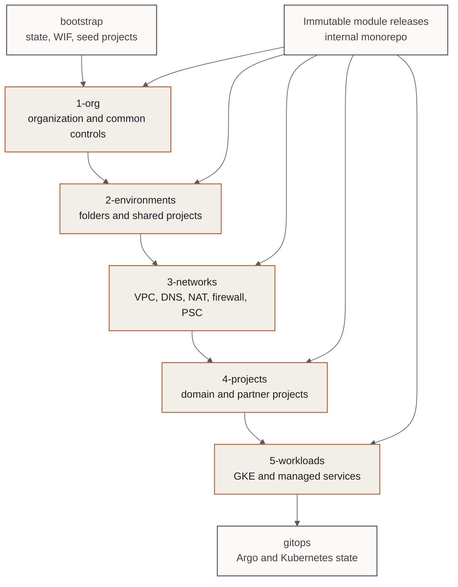

<!-- mindclade-doc: architecture@1 -->

# Mindclade · Infrastructure Live architecture

> **Audience:** Infrastructure, platform, security, and service engineers
> **Outcome:** Understand authority, layering, state, identity, and apply boundaries before
> changing the live cloud estate.

## Context

`infrastructure-live` begins after Ring 0 and expresses the normal Google Cloud estate as
small dependency-aware Terragrunt units. Numeric layers encode allowable dependency
direction; unit paths encode independent state prefixes and operational blast radius.

## Authority boundary

### Owns

- organization hierarchy and common controls;
- environment folders, projects, networks, DNS, and connectivity;
- domain and partner workload projects;
- GKE and managed services, including data, database, backup, observability, and secrets
  infrastructure; and
- cloud-side automation identities, Binary Authorization policy, and Argo CD prerequisites.

### Depends on

- `bootstrap` for durable state buckets, seed projects, initial federation, and recovery;
- `github-config` for repository policy, environments, and non-secret CI variables;
- immutable module releases from the internal monorepo; and
- protected GitHub environments for scope-specific apply approval.

### Explicitly excludes

- Argo CD installation, Kubernetes resources, application source, secret values, and normal
  direct workstation applies.

## Component model

The diagram shows dependency and handoff direction. Recovery rebuilds from top to bottom;
approved decommission proceeds in the reverse direction.

| Layer | Responsibility | Typical dependencies |
| --- | --- | --- |
| `1-org` | Organization folders, policies, common projects, security controls | Ring-0 outputs |
| `2-environments` | Environment folders and shared host/foundation projects | `1-org` |
| `3-networks` | Shared and environment network infrastructure | `1-org`, `2-environments` |
| `4-projects` | Workload project placement and network attachment | `2-environments`, `3-networks` |
| `5-workloads` | GKE and managed cloud services | Lower layers and approved shared controls |

## State and environment boundaries

Every `terragrunt.hcl` is an independent state unit whose prefix derives from its repository
path. Development and staging use isolated state buckets and apply identities.
Organization, shared, and production units use the bootstrap-created production/foundation
state boundary. External dependencies are read from remote state and are not implicitly
applied with another privilege scope.

Development, staging, and production retain the same security and identity shape. Capacity,
availability, retention, and accelerator configuration differ intentionally through
environment configuration; lower environments do not silently omit trust boundaries.

## Change and apply flow

On a merge, `scripts/select-apply-scopes.py` maps changed paths to the minimum of
`foundation`, `development`, `staging`, `production`, or `partners`. Global account or shared
configuration can select multiple scopes. `scripts/terragrunt-scope.py` creates an exact plan
bundle with account context, run context, classification, and checksums.

The protected apply downloads that one-day artifact, requires explicit authorization for
deletes or replacements, selects the matching scope identity, revalidates account and commit
context, verifies all checksums, and applies the saved plans. A scope cannot apply a unit
outside its allowed path.

## Trust and security boundaries

The plan identity is separate from the foundation, development, staging, and production
apply identities. GitHub OIDC and Google Cloud Workload Identity Federation replace static
service-account keys. Immutable module fetches use a short-lived GitHub App token. Plans,
state, provider credentials, and secret values are sensitive and never committed.

## Failure domains and recovery

| Failure | Containment | Recovery |
| --- | --- | --- |
| Invalid layer edge | Dependency-order validation fails | Correct the unit boundary or dependency |
| Account contract drift | Plan or apply fails before mutation | Regenerate from verified bootstrap outputs |
| Plan checksum or commit mismatch | Apply fails closed | Replan the intended `main` commit |
| Failed apply | One selected scope/unit; incident issue created | Use [failed production apply](runbooks/failed-production-apply.md) |
| Stuck state lock | One state unit | Use [state lock stuck](runbooks/state-lock-stuck.md) |
| Lost GKE cluster | Cloud and GitOps recovery remain separated | Use [GKE reconstruction](runbooks/gke-reconstruction.md) |

## Invariants

- Dependencies do not point from a lower-numbered layer to a higher-numbered layer.
- Cross-environment dependencies are prohibited except explicitly shared resources.
- One Terragrunt unit owns one independent state prefix.
- Apply identities and protected environments remain scoped.
- Applied plans match their checksums, account context, unit scope, and commit.
- Kubernetes desired state remains in `gitops`.

## Related documentation

- [Dependency graph and apply order](dependency-graph.md)
- [State boundaries](state-boundaries.md)
- [Production activation gates](production-activation-gates.md)
- [GitOps handoff](gitops-handoff.md)
- [Runbooks](runbooks/README.md)
