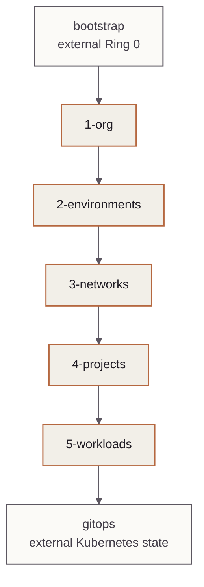

<!-- mindclade-doc: reference@1 -->

# Dependency graph and apply order

> **Audience:** Infrastructure reviewers and operators  
> **Outcome:** Identify legal dependency direction, apply order, and the scope that owns a
> live unit.

The numeric tree is an enforced dependency contract, not cosmetic organization.



A dependency may point within its layer or to a lower-numbered layer. Cross-environment
references are prohibited except explicitly shared resources under `3-networks/shared` and
organization/common resources under `1-org`.

## Key edges

| Consumer | Dependency | Purpose |
| --- | --- | --- |
| `1-org/common-projects` | `1-org/folders` | Place common projects in the common folder |
| `2-environments/<env>/folders` | `1-org/folders` | Create domain child folders |
| `2-environments/<env>/shared-projects` | `1-org/folders` | Create environment host/foundation projects |
| `3-networks/<env>/shared-vpc-host` | environment shared projects | Host-project identity |
| `4-projects/<env>/<domain>` | environment folders and Shared VPC | Project placement and attachment |
| `5-workloads/<env>/gke` | environment project, VPC, and KMS | Private cluster foundation |
| `5-workloads/ci/bazel-remote-cache` | common CI project, global KMS, shared cache access logs, and automation IAM | GitHub-hosted Bazel read/cache foundation |
| `5-workloads/ci/nix-binary-cache` | common CI project, `ci_artifacts` KMS, shared cache access logs, and the dedicated storage identity | Private, create-only GCS backend for a separately qualified Attic service |
| `5-workloads/ci/nix-cache-secrets` | common CI project, `ci_secrets` KMS, and exact `mindclade-cache/attic-secret-sync` identity | Secret containers only; no values, HMAC resource, or GitHub accessor |
| `5-workloads/<env>/bazel-remote-cache` | environment project/KMS and shared cache access-log bucket | Protected rebuildable CAS/action-cache storage |
| `5-workloads/<env>/bazel-remote-execution` | GKE, VPC pod range, and Bazel cache | Dedicated keyless multi-zone worker foundation |
| `2-environments/<env>/kms-dr` | environment project inventory | Region-local `us-east4` recovery keys |
| `5-workloads/<env>/artifact-registry-dr` | environment project and recovery KMS | Immutable U.S. recovery image repository |
| `5-workloads/<env>/backup-dr` | GKE and recovery KMS | Encrypted cross-region cluster and object recovery |
| `5-workloads/<env>/cloud-sql` | VPC, private service access, primary and recovery KMS | Private primary database and U.S. recovery replica |
| `5-workloads/<env>/secret-manager` | environment project, primary and recovery KMS | Explicit two-region secret replicas |
| `5-workloads/<env>/workload-identities` | research and platform projects | Create zero-role GSAs and bind exact environment KSAs |
| `5-workloads/<env>/nodepools/*` | GKE | Cluster attachment |
| `5-workloads/<env>/binary-authorization` | GKE and organization attestor/KMS | Admission trust |
| `5-workloads/<env>/storage/*` | domain projects, networking, and workload identities | Data-plane ownership and typed holdout deny principals |
| `3-networks/shared/public-zones/*` | common DNS project | Authoritative public DNS |

`5-workloads/<env>/argocd-prereqs` is documentation/cloud handoff only. Argo CD installation
and reconciliation are exclusively owned by `gitops`.

## CI execution

CI uses modern dependency-aware commands with strict mode:

```sh
TG_STRICT_MODE=true terragrunt run --all --non-interactive -- plan
```

The protected apply workflow saves plans with Terragrunt `--out-dir` and applies the same
plans after environment approval. External dependencies are read from remote state and are
not implicitly applied with another privilege scope.

`5-workloads/ci` is a shared control-plane path selected only by the protected **foundation**
scope. Development, staging, and production environment identities cannot plan or apply the
common GitHub cache unit.

## Recovery

Rebuild in numeric order. Destroy in reverse order. Critical projects, KMS, stateful storage,
and production clusters require an explicit decommission procedure before deletion protection
is removed.
